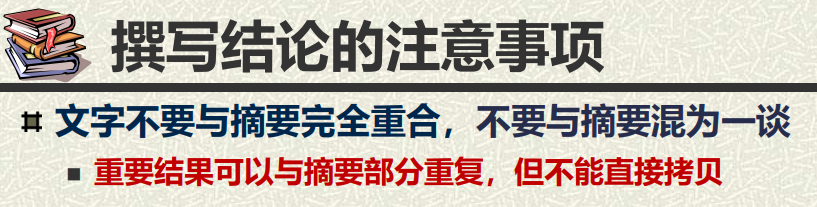
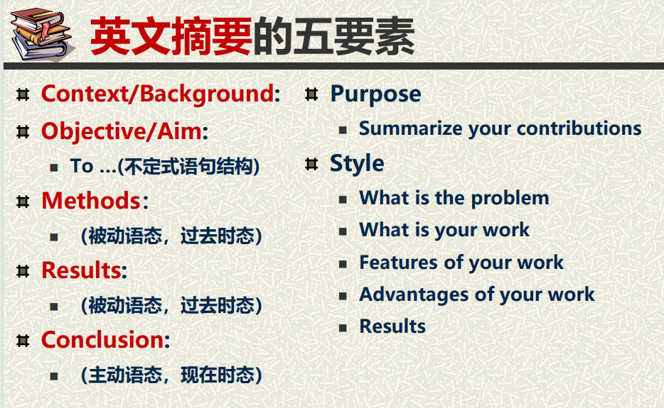

## 0 课程概述
学术写作与学术规范的考核方式分成三个部分，线下小班讨论成绩占10%，期末的文献综述大作业占60%，期末考试占30%。
## 1 课堂小组展示
线下小班讨论2-3人一个小组，可以搜索学术论文或学位论文，根据学术写作规范要求（需要看MOOC），对论文进行分析和点评，具体指出好在哪里，不好在哪里；也可以分享学术论文或学位论文写作的经验和体会。由教师和助教根据每个小组的整体表现给每个小组整体打分，取平均后作为小组所有人的成绩。

我们组当时是搜了两篇文章，分别指出了各个部分的优点和缺点，然后在结尾总结了写作的经验和体会，具体内容可以参考仓库里的PPT，希望能有所帮助 :)

## 2 文献综述报告

文献综述报告就是对一个研究领域进行综述，可以重点关注一下MOOC中提到的格式问题，我把我的报告放在了仓库，希望能有所帮助 :)

## 3 期末考试
期末考试的内容以MOOC中的PPT为准，题型包括多选题、判断题和大题三个部分。

### 3.1 多选题
多选题一共有5道，一道2分，都很简单，第一道是如何找到有价值的文献，第二道是计算机的3个全文数据库，第三道是开题报告的考察点，第四道是中期检查的常见问题，第五道是学术失范的例子

### 3.2 判断题
判断题一共15道，每道1分，都是一些很简单的内容，有点难的一道题是:

“摘要和结论都是对文章的总结，所以二者可以重复”

当时在考场上纠结了好久，最终判断该选项是对的，后面看了看课件，应该是选对了 :)

### 3.3 大题
大题也特别简单，内容是给你一段英文学术论文摘要，让你结合摘要指出英文摘要的五要素:

